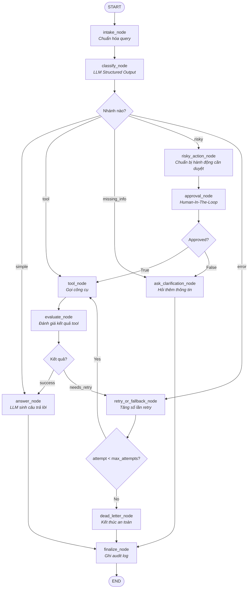

# KẾ HOẠCH TRIỂN KHAI SUPPORT-TICKET AI AGENT BẰNG LANGGRAPH

## 1. Mục tiêu

Xây dựng hệ thống **Support-Ticket AI Agent** bằng LangGraph, có khả năng:

- Tiếp nhận và chuẩn hóa yêu cầu của người dùng.
- Dùng LLM để phân loại yêu cầu vào 5 nhóm:
  - `simple`
  - `tool`
  - `missing_info`
  - `risky`
  - `error`
- Gọi công cụ khi cần tra cứu hoặc thực hiện hành động.
- Dùng Human-In-The-Loop (HITL) cho các hành động rủi ro.
- Tự động retry khi tool gặp lỗi nhưng có giới hạn số lần thử.
- Chuyển sang Dead Letter khi hết số lần retry.
- Đảm bảo mọi luồng đều đi qua `finalize_node` để ghi audit log trước khi kết thúc.

---

## 2. Kiến trúc LangGraph giữ nguyên



---

# 3. Kế hoạch triển khai

## Giai đoạn 1 - Xây dựng Agent State

Tạo state dùng chung cho toàn bộ graph.

Ví dụ:

```python
from typing import Any, TypedDict


class AgentState(TypedDict):
    query: str
    normalized_query: str

    route: str | None
    risk_level: str | None

    tool_name: str | None
    tool_args: dict | None
    tool_results: Any | None
    tool_error: str | None

    evaluation_result: str | None

    attempt: int
    max_attempts: int

    pending_action: dict | None
    approved: bool | None

    clarification_question: str | None
    final_answer: str | None

    errors: list[str]
    audit_events: list[dict]
```

### Yêu cầu

- State phải chứa đủ dữ liệu để các node không phụ thuộc vào biến global.
- `attempt` khởi tạo bằng `0`.
- `max_attempts` nên cấu hình được, ví dụ `3`.
- Lỗi của tool phải được lưu vào `tool_error`.
- Các sự kiện quan trọng phải được lưu vào `audit_events`.

---

# 4. Giai đoạn 2 - Xây dựng `intake_node`

## Nhiệm vụ

- Nhận query từ người dùng.
- Loại bỏ khoảng trắng thừa.
- Kiểm tra input rỗng.
- Khởi tạo các biến state cần thiết.
- Ghi audit event đầu tiên.

Ví dụ:

```python
def intake_node(state: AgentState):
    query = state["query"].strip()

    return {
        "normalized_query": query,
        "attempt": 0,
        "tool_error": None,
        "errors": [],
        "audit_events": [
            {
                "event": "intake",
                "query": query,
            }
        ],
    }
```

Không nên đưa logic phân loại hoặc gọi tool vào node này.

---

# 5. Giai đoạn 3 - Xây dựng `classify_node`

Đây là node quan trọng nhất của bài lab.

## Yêu cầu bắt buộc

Phải dùng:

```python
llm.with_structured_output(...)
```

Không được chỉ dùng rule-based hoặc keyword matching để thay thế hoàn toàn LLM.

## Structured Output

Có thể định nghĩa:

```python
from typing import Literal
from pydantic import BaseModel


class ClassificationResult(BaseModel):
    route: Literal[
        "simple",
        "tool",
        "missing_info",
        "risky",
        "error",
    ]

    risk_level: Literal[
        "none",
        "low",
        "medium",
        "high",
    ]

    tool_name: str | None = None
    reason: str
```

Sau đó:

```python
classifier = llm.with_structured_output(ClassificationResult)
```

## Priority bắt buộc

Classifier phải tuân thủ:

```text
risky
>
tool
>
missing_info
>
error
>
simple
```

Ví dụ câu:

```text
Hoàn tiền đơn hàng ORD-123 cho tôi.
```

Có thể vừa cần tool vừa là hành động risky.

Kết quả bắt buộc phải là:

```json
{
  "route": "risky",
  "risk_level": "high"
}
```

Không được route thẳng sang `tool`.

## Safety Check bổ sung

Sau khi LLM classify, nên có một lớp deterministic validation:

```python
RISKY_ACTIONS = {
    "refund",
    "delete_account",
    "send_email",
}
```

Nếu action nằm trong nhóm này:

```python
route = "risky"
```

Điều này ngăn LLM vô tình bypass HITL.

---

# 6. Giai đoạn 4 - Conditional Routing sau Classify

Cài đặt:

```python
def route_after_classify(state: AgentState):
    route = state.get("route")

    mapping = {
        "simple": "answer",
        "tool": "tool",
        "missing_info": "clarify",
        "risky": "risky_action",
        "error": "retry",
    }

    return mapping.get(route, "answer")
```

Sau đó đăng ký bằng:

```python
graph.add_conditional_edges(...)
```

---

# 7. Giai đoạn 5 - Xây dựng `answer_node`

## Nhiệm vụ

Dùng LLM thật để tạo câu trả lời cuối cùng.

LLM phải có thể sử dụng:

- Query gốc.
- Tool results.
- Approval result.
- Context hiện tại.
- Error information nếu phù hợp.

Luồng:

```text
query
   +
tool_results
   +
approval/context
   ↓
  LLM
   ↓
final_answer
```

Không nên hard-code toàn bộ câu trả lời.

---

# 8. Giai đoạn 6 - Xây dựng `ask_clarification_node`

Node này được dùng khi:

```text
route = missing_info
```

hoặc:

```text
approval = False
```

Ví dụ:

```text
Người dùng:
Kiểm tra đơn hàng giúp tôi.

Agent:
Bạn vui lòng cung cấp mã đơn hàng để tôi kiểm tra.
```

Sau đó:

```text
clarify
   ↓
finalize
   ↓
END
```

Việc kết thúc graph ở đây là hợp lý.

Khi người dùng gửi thông tin bổ sung, application chạy một execution mới với conversation/thread tương ứng.

---

# 9. Giai đoạn 7 - Xây dựng `risky_action_node`

Node này chưa thực hiện hành động.

Nó chỉ tạo proposal để gửi cho người duyệt.

Ví dụ:

```json
{
  "action": "refund_order",
  "risk_level": "high",
  "arguments": {
    "order_id": "ORD-123",
    "amount": 500000
  },
  "reason": "User requested a refund"
}
```

Lưu vào:

```python
state["pending_action"]
```

Không gọi tool trực tiếp trong node này.

---

# 10. Giai đoạn 8 - Xây dựng `approval_node` bằng HITL

Các hành động sau phải có approval trước khi thực thi:

- Refund.
- Delete account.
- Send email.
- Các thao tác có side effect hoặc ảnh hưởng dữ liệu người dùng.

Sử dụng:

```python
from langgraph.types import interrupt
```

Ví dụ:

```python
def approval_node(state: AgentState):
    decision = interrupt({
        "type": "approval_required",
        "action": state["pending_action"],
    })

    return {
        "approved": bool(decision)
    }
```

Graph cần có checkpointer.

Ví dụ:

```python
config = {
    "configurable": {
        "thread_id": ticket_id
    }
}
```

Khi người duyệt quyết định:

```python
from langgraph.types import Command

graph.invoke(
    Command(resume=True),
    config=config,
)
```

### Quy tắc

```text
approved == True
→ tool

approved == False
→ clarify
```

Tool không được chạy trước approval.

---

# 11. Giai đoạn 9 - Xây dựng `tool_node`

`tool_node` chịu trách nhiệm:

- Chọn tool.
- Chuẩn bị arguments.
- Gọi tool.
- Lưu kết quả.
- Catch exception.

Không được để exception dự kiến thoát khỏi node làm graph crash.

Ví dụ:

```python
def tool_node(state: AgentState):
    try:
        result = execute_tool(
            state["tool_name"],
            state["tool_args"],
        )

        return {
            "tool_results": result,
            "tool_error": None,
        }

    except Exception as exc:
        return {
            "tool_results": None,
            "tool_error": str(exc),
        }
```

Sau đó luôn chuyển sang:

```text
evaluate_node
```

---

# 12. Giai đoạn 10 - Idempotency cho Risky Tool

Đây là phần rất nên có.

Giả sử:

```text
refund
→ tool chạy thành công
→ response timeout
→ retry
→ refund lần hai
```

Nếu không kiểm soát, người dùng có thể được hoàn tiền hai lần.

Các tool có side-effect như:

- refund;
- payment;
- delete;
- send email;

nên dùng:

```python
idempotency_key
```

Ví dụ:

```python
idempotency_key = f"{thread_id}:{action_id}"
```

Tool/backend phải bảo đảm cùng một `idempotency_key` không thực thi side-effect nhiều lần.

---

# 13. Giai đoạn 11 - Xây dựng `evaluate_node`

Node này không chỉ kiểm tra tool có exception hay không.

Nó phải đánh giá:

```text
Tool execution successful?
        +
Result usable?
```

Ví dụ API trả:

```json
{
  "status": 200,
  "data": []
}
```

không đồng nghĩa dữ liệu đủ tốt để trả lời người dùng.

Kết quả evaluate chỉ cần:

```text
success
```

hoặc:

```text
needs_retry
```

Ví dụ:

```python
def evaluate_node(state: AgentState):

    if state.get("tool_error"):
        return {
            "evaluation_result": "needs_retry"
        }

    if state.get("tool_results") is None:
        return {
            "evaluation_result": "needs_retry"
        }

    return {
        "evaluation_result": "success"
    }
```

---

# 14. Giai đoạn 12 - Retry có giới hạn

Node:

```text
retry_or_fallback_node
```

chịu trách nhiệm tăng:

```python
attempt
```

Ví dụ:

```python
def retry_or_fallback_node(state: AgentState):

    attempt = state.get("attempt", 0) + 1

    return {
        "attempt": attempt,
        "errors": state.get("errors", []) + [
            state.get("tool_error") or "retry requested"
        ],
    }
```

Router:

```python
def route_after_retry(state: AgentState):

    if state["attempt"] < state["max_attempts"]:
        return "tool"

    return "dead_letter"
```

Ví dụ:

```text
max_attempts = 3
```

Luồng:

```text
attempt = 1 → retry tool
attempt = 2 → retry tool
attempt = 3 → dead_letter
```

Không được có infinite loop.

---

# 15. Giai đoạn 13 - Xây dựng `dead_letter_node`

Khi:

```text
attempt >= max_attempts
```

chuyển sang:

```text
dead_letter_node
```

Node này phải:

- Dừng retry.
- Ghi lại lỗi.
- Trả lời người dùng an toàn.
- Không expose stack trace.
- Không tiếp tục gọi tool.

Ví dụ:

```text
Hiện tại hệ thống chưa thể hoàn thành yêu cầu sau nhiều lần thử.
Vui lòng thử lại sau hoặc liên hệ nhân viên hỗ trợ.
```

Sau đó:

```text
dead_letter
    ↓
finalize
    ↓
END
```

---

# 16. Giai đoạn 14 - Xây dựng `finalize_node`

Đây là node bắt buộc của mọi execution.

Tất cả các nhánh phải đi qua:

```text
finalize_node
```

trước:

```text
END
```

Audit event nên chứa:

```json
{
  "event": "finalize",
  "route": "tool",
  "status": "success",
  "attempts": 1,
  "tool_used": "lookup_ticket",
  "approved": null
}
```

Risky action:

```json
{
  "event": "finalize",
  "route": "risky",
  "status": "success",
  "action": "refund_order",
  "approved": true,
  "attempts": 1
}
```

Dead Letter:

```json
{
  "event": "finalize",
  "route": "tool",
  "status": "dead_letter",
  "attempts": 3
}
```

---

# 17. Lưu ý riêng cho route `error`

Theo đề bài:

```text
classify
→ error
→ retry
→ tool
```

Nên giữ topology này để đúng yêu cầu lab.

Tuy nhiên phải định nghĩa rõ `error`.

Nếu classifier trả:

```json
{
  "route": "error"
}
```

thì state vẫn cần biết:

```text
tool_name
tool_args
```

để sau:

```text
retry → tool
```

có thể chạy được.

Không nên để tình trạng:

```text
route = error
tool_name = None
tool_args = None
```

nhưng graph vẫn chuyển vào `tool_node`.

---

# 18. Thứ tự triển khai code

Nên xây dựng theo thứ tự sau:

```text
1. AgentState

2. intake_node

3. classify_node
   + Structured Output
   + priority validation

4. route_after_classify

5. answer_node

6. ask_clarification_node

7. tool_node

8. evaluate_node

9. retry_or_fallback_node

10. route_after_evaluate

11. route_after_retry

12. dead_letter_node

13. risky_action_node

14. approval_node
    + interrupt
    + checkpointer

15. route_after_approval

16. finalize_node

17. Build StateGraph

18. Compile graph

19. Unit tests

20. Integration tests cho 5 scenario
```

---

# 19. Test Cases bắt buộc

## Test 1 - Simple

Input:

```text
Xin chào, trung tâm hỗ trợ làm việc lúc mấy giờ?
```

Expected:

```text
START
→ intake
→ classify
→ answer
→ finalize
→ END
```

---

## Test 2 - Tool

Input:

```text
Kiểm tra trạng thái đơn hàng ORD-123.
```

Expected:

```text
START
→ intake
→ classify
→ tool
→ evaluate
→ answer
→ finalize
→ END
```

---

## Test 3 - Missing Information

Input:

```text
Kiểm tra đơn hàng giúp tôi.
```

Expected:

```text
START
→ intake
→ classify
→ clarify
→ finalize
→ END
```

---

## Test 4 - Risky + Approved

Input:

```text
Hoàn tiền đơn hàng ORD-123.
```

Expected:

```text
START
→ intake
→ classify
→ risky_action
→ approval
→ tool
→ evaluate
→ answer
→ finalize
→ END
```

Phải kiểm tra:

```text
tool chưa được chạy trước approval
```

---

## Test 5 - Risky + Rejected

Expected:

```text
risky_action
→ approval
→ clarify
→ finalize
→ END
```

Tool không được thực thi.

---

## Test 6 - Retry thành công

Mock tool:

```text
Attempt 1 → fail
Attempt 2 → success
```

Expected:

```text
tool
→ evaluate
→ retry
→ tool
→ evaluate
→ answer
→ finalize
→ END
```

---

## Test 7 - Dead Letter

Mock tool luôn lỗi.

Expected:

```text
tool
→ evaluate
→ retry
→ tool
→ evaluate
→ retry
→ ...
→ dead_letter
→ finalize
→ END
```

Phải xác nhận:

```text
attempt <= max_attempts
```

và graph không loop vô hạn.

---

# 20. Tiêu chí hoàn thành

Hệ thống chỉ được coi là hoàn thành khi:

- [ ] Có đủ 11 nodes.
- [ ] `classify_node` dùng LLM thật.
- [ ] `classify_node` dùng `.with_structured_output()`.
- [ ] Có đủ 5 route.
- [ ] Enforce priority `risky > tool > missing_info > error > simple`.
- [ ] `answer_node` dùng LLM thật.
- [ ] Risky action không thể bypass approval.
- [ ] `approval_node` sử dụng HITL.
- [ ] Có checkpointer cho interrupt/resume.
- [ ] Tool exception không làm graph crash trực tiếp.
- [ ] Có `evaluate_node`.
- [ ] Có bounded retry.
- [ ] Có `max_attempts`.
- [ ] Có Dead Letter.
- [ ] Risky tool có cơ chế idempotency nếu có side-effect.
- [ ] Tất cả nhánh đều đi qua `finalize_node`.
- [ ] Có audit event.
- [ ] Test thành công đủ 5 scenario chính.
- [ ] Có test riêng retry và dead letter.
- [ ] Không tồn tại infinite loop.

---

# 21. Kiến trúc mục tiêu cuối cùng

```text
                       ┌──────── answer ─────────────┐
                       │                             │
START → intake → classify                            │
                  │                                  │
                  ├─ simple ─────────────────────────┤
                  │                                  │
                  ├─ tool → tool → evaluate ─success─┤
                  │            ↑         │           │
                  │            │         retry       │
                  │            │           │         │
                  │            └─attempt < max       │
                  │                        │          │
                  │                    exhausted      │
                  │                        ↓          │
                  │                   dead_letter ────┤
                  │                                  │
                  ├─ missing_info → clarify ─────────┤
                  │                                  │
                  └─ risky → risky_action → approval │
                                         │           │
                                  approve → tool     │
                                  reject → clarify   │
                                                     ↓
                                                 finalize
                                                     ↓
                                                    END
```

---

# 22. Kết luận

Kiến trúc hiện tại **không cần viết lại**. Phần graph đã đáp ứng tốt yêu cầu của bài lab.

Trọng tâm triển khai cần tập trung vào 5 phần:

1. `classify_node` dùng LLM Structured Output và enforce đúng priority.
2. `approval_node` dùng HITL thật bằng `interrupt()`.
3. `tool_node` catch exception và không để graph crash.
4. Retry phải có giới hạn và chuyển Dead Letter khi hết lượt.
5. Tất cả execution path phải đi qua `finalize_node` để ghi audit log.

Nếu các phần trên được triển khai đúng, hệ thống sẽ đáp ứng đầy đủ các yêu cầu chính của đề bài Support-Ticket AI Agent.
