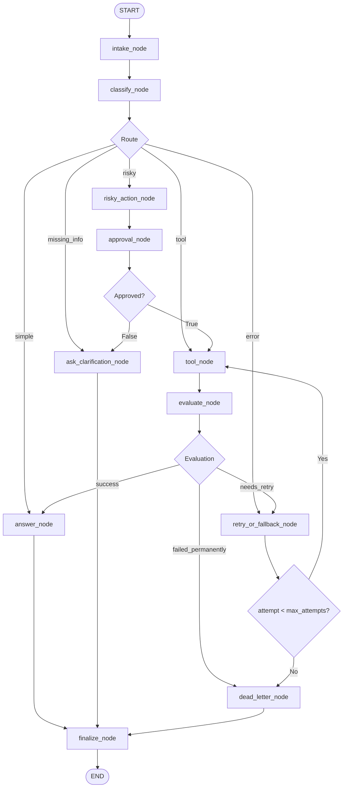

# KẾ HOẠCH TỐI ƯU SUPPORT-TICKET AI AGENT BẰNG LANGGRAPH

## 1. Mục tiêu tối ưu

Mục tiêu của giai đoạn này là **giữ nguyên kiến trúc 11 node hiện tại**, nhưng tăng độ an toàn, ổn định và khả năng vận hành thực tế của hệ thống.

Các mục tiêu chính:

- Không thay đổi topology chính của LangGraph.
- Làm rõ ý nghĩa của route `error`.
- Chỉ retry những lỗi có khả năng phục hồi.
- Ngăn hành động `risky` bị thực thi nhiều lần khi retry.
- Validate dữ liệu trước khi gọi tool.
- Giữ ngữ cảnh khi người dùng cần bổ sung thông tin.
- Bảo đảm lỗi LLM/tool không làm graph chết trước `finalize_node`.
- Cải thiện audit trail để dễ kiểm tra và debug.

---

# 2. Kiến trúc hiện tại cần giữ nguyên



> Lưu ý: Node vẫn giữ nguyên. Chỉ mở rộng logic bên trong `evaluate_node` để hỗ trợ thêm trạng thái `failed_permanently`.

---

# 3. Ưu tiên triển khai

## Priority 1 - Làm rõ route `error`

### Vấn đề hiện tại

Luồng đang có:

```text
classify
   ↓
 error
   ↓
retry
   ↓
tool
```

Nhưng `error` có thể bị hiểu nhầm giữa:

1. Người dùng đang báo một lỗi.
2. Hệ thống nội bộ đang gặp lỗi.

Hai trường hợp này không giống nhau.

### Cách tối ưu

Quy ước:

```text
route = "error"
```

chỉ dùng cho:

> Ticket cần thực hiện một công cụ chẩn đoán/xử lý lỗi.

Ví dụ:

```text
"Tài khoản của tôi không đăng nhập được."
```

Classifier có thể trả:

```json
{
  "route": "error",
  "risk_level": "none",
  "tool_name": "diagnose_login_issue"
}
```

Trong khi lỗi runtime như:

```text
Timeout
HTTP 503
Connection reset
Tool exception
```

không được lưu vào `route`.

Thay vào đó lưu riêng:

```python
error_type
last_error
retryable
```

---

# 4. Priority 2 - Phân loại lỗi Retryable và Non-Retryable

## Vấn đề

Không nên retry tất cả lỗi.

Ví dụ:

```text
400 Bad Request
401 Unauthorized
403 Forbidden
404 Not Found
```

retry nhiều lần thường không giải quyết được vấn đề.

## Retryable Errors

Có thể retry:

```text
Timeout
429 Too Many Requests
502 Bad Gateway
503 Service Unavailable
Connection Reset
Temporary Network Failure
```

Ví dụ:

```python
RETRYABLE_ERRORS = {
    "timeout",
    "rate_limit",
    "bad_gateway",
    "service_unavailable",
    "connection_reset",
}
```

## Non-Retryable Errors

Không nên retry:

```text
validation_error
invalid_argument
unauthorized
forbidden
not_found
```

## Logic

```python
if error_type in RETRYABLE_ERRORS:
    evaluation_result = "needs_retry"
else:
    evaluation_result = "failed_permanently"
```

Kết quả của `evaluate_node` nên hỗ trợ:

```text
success
needs_retry
failed_permanently
```

Routing:

```text
success
    ↓
answer

needs_retry
    ↓
retry

failed_permanently
    ↓
dead_letter
```

---

# 5. Priority 3 - Validate Tool Call trước khi thực thi

## Vấn đề

Không nên để LLM tạo arguments rồi gọi API ngay.

Ví dụ:

```json
{
  "tool_name": "refund_order",
  "tool_args": {
    "order_id": null
  }
}
```

Nếu gọi tool trực tiếp sẽ tạo lỗi không cần thiết.

## Giải pháp

Dùng Pydantic validation.

Ví dụ:

```python
from pydantic import BaseModel


class RefundArgs(BaseModel):
    order_id: str
    amount: float
```

Sau đó:

```text
LLM/tool arguments
        ↓
Pydantic validation
        ↓
Valid?
 ├── Yes → Execute tool
 └── No  → Ask clarification
```

Các field bắt buộc phải được kiểm tra trước khi gọi tool.

---

# 6. Priority 4 - Bảo vệ hành động Risky sau khi Approval

## Vấn đề

Sau khi human approve:

```json
{
  "action": "refund",
  "amount": 500000
}
```

LLM không được phép thay đổi dữ liệu trước khi thực thi thành:

```json
{
  "amount": 1000000
}
```

## Giải pháp

Trước `approval_node`, tạo một immutable proposal:

```python
pending_action = {
    "action_id": "...",
    "tool_name": "refund_order",
    "tool_args": {
        "order_id": "ORD-123",
        "amount": 500000
    }
}
```

Human approve chính object này.

Sau approval:

```text
approval
   ↓
tool_node
```

`tool_node` phải chạy đúng:

```python
pending_action["tool_name"]
pending_action["tool_args"]
```

Không gọi LLM để sinh lại arguments sau approval.

---

# 7. Priority 5 - Thêm `action_id` và Idempotency

## Vấn đề

Ví dụ:

```text
Refund
  ↓
Tool thực thi thành công
  ↓
Response timeout
  ↓
Retry
  ↓
Refund lần 2
```

Có thể gây side-effect lặp.

## Giải pháp

Mỗi risky action tạo:

```python
action_id
```

và:

```python
idempotency_key
```

Ví dụ:

```python
idempotency_key = f"{thread_id}:{action_id}"
```

Tool/backend kiểm tra:

```text
Nếu idempotency_key đã được execute
→ trả lại kết quả cũ
→ không thực hiện action lần nữa
```

Cần áp dụng cho:

- Refund.
- Payment.
- Delete account.
- Send email.
- Update dữ liệu quan trọng.
- Các tool có side-effect.

---

# 8. Priority 6 - Giữ context cho Clarification

## Vấn đề

User:

```text
Kiểm tra đơn hàng cho tôi.
```

Agent:

```text
Bạn vui lòng cung cấp mã đơn hàng.
```

User:

```text
ORD-123
```

Nếu classify lại hoàn toàn, `"ORD-123"` có thể bị hiểu sai vì thiếu ngữ cảnh.

## Giải pháp

State cần giữ:

```python
pending_route
pending_tool
missing_fields
pending_tool_args
```

Ví dụ:

```python
{
    "pending_route": "tool",
    "pending_tool": "lookup_order",
    "missing_fields": ["order_id"],
    "pending_tool_args": {}
}
```

Khi user trả:

```text
ORD-123
```

hệ thống merge:

```python
pending_tool_args = {
    "order_id": "ORD-123"
}
```

Sau khi đủ dữ liệu:

```text
tool_node
```

có thể thực thi.

---

# 9. Priority 7 - Không để `classify_node` trở thành God Node

## Không nên

```text
classify_node
    ├── classify intent
    ├── chọn tool
    ├── generate arguments
    ├── kiểm tra risk
    ├── viết answer
    └── quyết định retry
```

## Nên

`classify_node` tập trung vào:

```text
route
risk_level
classification_reason
```

Các tác vụ khác được xử lý bởi helper hoặc node tương ứng.

Ví dụ:

```text
classify
   ↓
tool route
   ↓
tool helper chuẩn bị arguments
   ↓
validation
   ↓
execute
```

Không nhất thiết thêm node mới nếu đề yêu cầu giữ đúng 11 node.

Có thể triển khai helper function bên trong `tool_node`.

---

# 10. Priority 8 - Tối ưu `evaluate_node`

## Bước 1 - Deterministic Evaluation

Kiểm tra trước bằng code:

```python
if state.get("tool_error"):
    ...
elif state.get("tool_results") is None:
    ...
elif invalid_schema:
    ...
else:
    ...
```

Không cần LLM cho các kiểm tra đơn giản.

## Bước 2 - Semantic Evaluation nếu cần

Chỉ dùng LLM nếu cần đánh giá:

> Kết quả tool có đủ thông tin để trả lời câu hỏi không?

Flow:

```text
Tool Result
    ↓
Technical Validation
    ↓
Semantic Evaluation (optional)
    ↓
Evaluation Result
```

Điều này giúp:

- giảm latency;
- giảm token;
- giảm chi phí;
- tăng tính deterministic.

---

# 11. Priority 9 - Timeout cho Tool

Một tool có thể không trả exception nhưng treo quá lâu.

Ví dụ:

```text
External API
    ↓
Waiting 40 seconds...
```

Nên có timeout.

Ví dụ:

```python
TOOL_TIMEOUT_SECONDS = 8
```

Sau timeout:

```text
ToolTimeout
    ↓
evaluate
    ↓
needs_retry
```

Timeout phải được xem là retryable error nếu phù hợp.

---

# 12. Priority 10 - Exponential Backoff cho Retry

Không nên retry liên tục:

```text
attempt 1
attempt 2
attempt 3
```

mà không có khoảng nghỉ.

Nên áp dụng:

```text
Attempt 1 → 0.5s
Attempt 2 → 1s
Attempt 3 → 2s
```

Công thức:

```python
delay = base_delay * (2 ** attempt)
```

Có thể thêm jitter:

```python
delay += random.uniform(0, 0.2)
```

Mục đích:

- giảm tải API;
- tránh request dồn dập;
- tăng khả năng phục hồi với lỗi tạm thời.

---

# 13. Priority 11 - Bảo đảm mọi lỗi đều đi về `finalize_node`

## Vấn đề

Nếu node throw exception:

```python
response = llm.invoke(...)
```

và exception không được catch:

```text
answer_node
   X
Graph crash
```

thì:

```text
finalize_node
```

không chạy.

## Giải pháp

Các lỗi dự kiến phải được chuyển thành state.

Ví dụ `answer_node`:

```python
def answer_node(state):
    try:
        response = llm.invoke(...)
        return {
            "final_answer": response.content,
        }

    except Exception:
        return {
            "final_answer": (
                "Hệ thống hiện chưa thể tạo câu trả lời. "
                "Vui lòng thử lại sau."
            )
        }
```

`tool_node` cũng tương tự:

```python
try:
    ...
except Exception as exc:
    return {
        "tool_error": normalize_error(exc),
    }
```

Mục tiêu:

```text
Expected Error
    ↓
State
    ↓
Routing
    ↓
finalize
    ↓
END
```

---

# 14. Priority 12 - Không expose Raw Exception

Không nên trực tiếp đưa:

```python
str(exception)
```

vào câu trả lời cho user.

Exception có thể chứa:

- Database host.
- Internal endpoint.
- Stack trace.
- SQL.
- API credential.
- Internal implementation details.

State nên phân biệt:

```python
internal_error
safe_error
```

Ví dụ:

```python
{
    "internal_error": repr(exc),
    "safe_error": "Temporary service failure"
}
```

Audit nội bộ:

```text
internal_error
```

LLM/user chỉ nhận:

```text
safe_error
```

---

# 15. Priority 13 - Audit Trail chi tiết

Không nên chỉ ghi:

```text
finalize
```

Nên ghi toàn bộ lifecycle.

Ví dụ:

```text
intake
classification_completed
tool_requested
approval_requested
approval_received
tool_started
tool_failed
retry_scheduled
tool_succeeded
answer_generated
finalize
```

Ví dụ event:

```json
{
  "event": "approval_received",
  "action_id": "ACTION-001",
  "approved": true
}
```

Retry:

```json
{
  "event": "retry_scheduled",
  "attempt": 2,
  "error_type": "timeout"
}
```

Finalize:

```json
{
  "event": "finalize",
  "status": "success",
  "route": "risky",
  "attempt": 2
}
```

Audit trail giúp:

- Debug.
- Demo.
- Trace execution.
- Kiểm tra HITL.
- Kiểm tra retry.
- Phân tích lỗi.

---

# 16. Agent State sau khi tối ưu

```python
from typing import Any, TypedDict


class AgentState(TypedDict):

    # Conversation
    query: str
    normalized_query: str

    # Classification
    route: str | None
    risk_level: str | None
    classification_reason: str | None

    # Multi-turn / Clarification
    pending_route: str | None
    pending_tool: str | None
    pending_tool_args: dict | None
    missing_fields: list[str]

    # Tool
    tool_name: str | None
    tool_args: dict | None
    tool_results: Any | None

    # Error
    tool_error: str | None
    internal_error: str | None
    safe_error: str | None
    error_type: str | None
    retryable: bool

    # Retry
    attempt: int
    max_attempts: int

    # HITL
    action_id: str | None
    pending_action: dict | None
    approved: bool | None
    idempotency_key: str | None

    # Evaluation
    evaluation_result: str | None

    # Response
    clarification_question: str | None
    final_answer: str | None

    # Audit
    audit_events: list[dict]
```

---

# 17. Logic `evaluate_node` đề xuất

```python
def evaluate_node(state: AgentState):

    if state.get("tool_error"):

        if state.get("retryable"):
            return {
                "evaluation_result": "needs_retry"
            }

        return {
            "evaluation_result": "failed_permanently"
        }

    if state.get("tool_results") is None:
        return {
            "evaluation_result": "needs_retry"
        }

    return {
        "evaluation_result": "success"
    }
```

Router:

```python
def route_after_evaluate(state: AgentState):

    result = state["evaluation_result"]

    if result == "needs_retry":
        return "retry"

    if result == "failed_permanently":
        return "dead_letter"

    return "answer"
```

---

# 18. Logic Retry đề xuất

```python
def retry_or_fallback_node(state: AgentState):

    attempt = state.get("attempt", 0) + 1

    return {
        "attempt": attempt,
        "audit_events": state["audit_events"] + [
            {
                "event": "retry",
                "attempt": attempt,
                "error_type": state.get("error_type"),
            }
        ],
    }
```

Router:

```python
def route_after_retry(state: AgentState):

    if state["attempt"] < state["max_attempts"]:
        return "tool"

    return "dead_letter"
```

---

# 19. Logic HITL tối ưu

## Bước 1

User yêu cầu:

```text
Hoàn tiền ORD-123.
```

## Bước 2

Classifier:

```text
route = risky
```

## Bước 3

`risky_action_node` tạo:

```python
{
    "action_id": "ACTION-001",
    "tool_name": "refund_order",
    "tool_args": {
        "order_id": "ORD-123"
    },
    "risk_level": "high"
}
```

## Bước 4

`approval_node`:

```text
Human Approve?
```

## Bước 5

Nếu:

```text
approved = True
```

tạo:

```python
idempotency_key = f"{thread_id}:ACTION-001"
```

## Bước 6

`tool_node` dùng đúng approved action.

Không generate action lại bằng LLM.

---

# 20. Luồng Risky sau tối ưu

```text
User
 ↓
intake
 ↓
classify
 ↓
risky_action
 ↓
Freeze Tool + Arguments
 ↓
approval
 ↓
Approved?
 ├── No
 │    ↓
 │ clarify
 │    ↓
 │ finalize
 │
 └── Yes
      ↓
 create idempotency_key
      ↓
 tool
      ↓
 evaluate
    ↙   ↓    ↘
success retry permanent
  ↓      ↓       ↓
answer   retry  dead_letter
  ↓               ↓
  └────── finalize
              ↓
             END
```

---

# 21. Kế hoạch triển khai theo giai đoạn

## Phase 1 - Error Model

Thực hiện:

- Chuẩn hóa semantics của `route = error`.
- Tạo `error_type`.
- Tạo `retryable`.
- Tạo `internal_error`.
- Tạo `safe_error`.

Kết quả:

```text
Business Route
```

không còn bị trộn với:

```text
Runtime Error
```

---

## Phase 2 - Tool Validation

Thực hiện:

- Tạo Pydantic schema cho từng tool.
- Validate arguments.
- Không gọi tool khi input thiếu.
- Missing fields chuyển thành clarification.

Kết quả:

```text
Invalid tool call
```

không còn tạo retry vô ích.

---

## Phase 3 - Retry Policy

Thực hiện:

- Retryable/non-retryable.
- `max_attempts`.
- Tool timeout.
- Exponential backoff.
- Dead Letter.

Kết quả:

```text
Retry
```

chỉ xảy ra khi thực sự có khả năng phục hồi.

---

## Phase 4 - HITL Safety

Thực hiện:

- `pending_action`.
- `action_id`.
- Freeze approved tool call.
- `idempotency_key`.
- Không regenerate arguments sau approval.

Kết quả:

```text
Risky Action
```

không bypass approval và không bị execute nhiều lần ngoài ý muốn.

---

## Phase 5 - Multi-turn Clarification

Thực hiện:

- `pending_route`.
- `pending_tool`.
- `missing_fields`.
- `pending_tool_args`.

Kết quả:

User chỉ cần trả lời:

```text
ORD-123
```

mà agent vẫn hiểu đang tiếp tục ticket trước.

---

## Phase 6 - Audit & Fallback

Thực hiện:

- Audit mỗi node quan trọng.
- Catch expected exception.
- Safe fallback response.
- Bảo đảm mọi path về `finalize`.

Kết quả:

```text
START
→ ...
→ finalize
→ END
```

được duy trì kể cả khi có lỗi có thể xử lý.

---

# 22. Bộ test cần bổ sung

## Test 1 - Non-Retryable Tool Error

Tool trả:

```text
401 Unauthorized
```

Expected:

```text
tool
→ evaluate
→ failed_permanently
→ dead_letter
→ finalize
→ END
```

Không retry.

---

## Test 2 - Retryable Tool Error

Tool:

```text
Attempt 1 → timeout
Attempt 2 → success
```

Expected:

```text
tool
→ evaluate
→ retry
→ tool
→ evaluate
→ answer
→ finalize
```

---

## Test 3 - Retry Exhausted

Tool luôn:

```text
503
```

Expected:

```text
retry
→ retry
→ ...
→ max_attempts
→ dead_letter
→ finalize
```

---

## Test 4 - Risky Action Cannot Bypass Approval

Input:

```text
Refund ORD-123.
```

Expected:

```text
classify.route == risky
```

Tool chưa được execute cho đến khi:

```text
approved == True
```

---

## Test 5 - Approved Arguments Cannot Change

Approval:

```json
{
  "amount": 500000
}
```

Expected tool call:

```json
{
  "amount": 500000
}
```

Không được thay đổi sau approval.

---

## Test 6 - Idempotency

Gọi cùng:

```text
action_id
idempotency_key
```

hai lần.

Expected:

```text
Side effect chỉ xảy ra một lần.
```

---

## Test 7 - Clarification Context

User:

```text
Kiểm tra đơn hàng.
```

Agent:

```text
Vui lòng nhập mã đơn hàng.
```

User:

```text
ORD-123
```

Expected:

```text
lookup_order(order_id="ORD-123")
```

không yêu cầu classify lại thành một task hoàn toàn mới.

---

## Test 8 - Tool Argument Validation

Tool yêu cầu:

```text
order_id
```

nhưng arguments thiếu.

Expected:

```text
clarification
```

không gọi tool.

---

## Test 9 - Answer LLM Failure

LLM answer bị lỗi.

Expected:

```text
safe fallback
→ finalize
→ END
```

Graph không crash.

---

## Test 10 - Audit Trail

Sau một risky flow thành công phải tồn tại:

```text
intake
classification
approval_requested
approval_received
tool_started
tool_succeeded
answer_generated
finalize
```

---

# 23. Checklist hoàn thành tối ưu

## Classification

- [ ] `classify_node` vẫn dùng LLM Structured Output.
- [ ] Giữ đủ 5 routes.
- [ ] Enforce priority `risky > tool > missing_info > error > simple`.
- [ ] `route=error` được định nghĩa rõ.
- [ ] Runtime error không bị trộn với classification route.

## Tool

- [ ] Tool arguments dùng schema.
- [ ] Validate trước khi execute.
- [ ] Tool có timeout.
- [ ] Catch expected exception.
- [ ] Error được normalize.

## Retry

- [ ] Có `retryable`.
- [ ] Có `error_type`.
- [ ] Không retry permanent error.
- [ ] Có `max_attempts`.
- [ ] Có bounded retry.
- [ ] Có exponential backoff.
- [ ] Có Dead Letter.

## HITL

- [ ] Risky action luôn qua approval.
- [ ] Tool chưa chạy trước approval.
- [ ] Approved action được freeze.
- [ ] Có `action_id`.
- [ ] Có `idempotency_key`.
- [ ] Retry không duplicate side-effect.

## Clarification

- [ ] Lưu `pending_route`.
- [ ] Lưu `pending_tool`.
- [ ] Lưu `missing_fields`.
- [ ] Có thể tiếp tục multi-turn ticket.

## Reliability

- [ ] LLM exception có fallback.
- [ ] Tool exception không crash graph.
- [ ] Không expose raw stack trace.
- [ ] Tất cả expected execution paths đều về `finalize`.

## Audit

- [ ] Audit classification.
- [ ] Audit HITL.
- [ ] Audit tool execution.
- [ ] Audit retry.
- [ ] Audit dead letter.
- [ ] Audit finalize.

---

# 24. Thứ tự code khuyến nghị

```text
1. Mở rộng AgentState

2. Chuẩn hóa error model
   - error_type
   - retryable
   - safe_error
   - internal_error

3. Tạo schema cho tool arguments

4. Validate tool input

5. Tối ưu evaluate_node
   - success
   - needs_retry
   - failed_permanently

6. Tối ưu retry policy
   - max attempts
   - timeout
   - backoff

7. Tối ưu risky_action_node
   - action_id
   - frozen action

8. Tối ưu approval_node

9. Thêm idempotency cho risky tool

10. Thêm pending context cho clarification

11. Thêm safe fallback cho LLM/tool

12. Mở rộng audit events

13. Viết unit tests

14. Viết integration tests

15. Chạy đủ các scenario end-to-end
```

---

# 25. Mục tiêu kiến trúc cuối cùng

Sau tối ưu, hệ thống cần đạt các đặc tính:

```text
LLM-driven classification
        +
Deterministic safety validation
        +
Validated tool calls
        +
Human approval for risky actions
        +
Idempotent side effects
        +
Retryable error detection
        +
Bounded retry
        +
Dead Letter
        +
Multi-turn clarification
        +
Complete audit trail
```

Trong khi vẫn giữ:

```text
11 Nodes
+
4 Conditional Routing Groups
+
finalize → END
```

theo đúng cấu trúc bài lab.

---

# 26. Kết luận

Không cần viết lại LangGraph hiện tại.

Phần cần làm là **tăng độ chắc chắn của logic bên trong graph**, đặc biệt tập trung vào:

1. Phân biệt business `error` và runtime error.
2. Retry đúng loại lỗi.
3. Validate tool arguments.
4. Bảo vệ risky action bằng HITL + frozen action.
5. Dùng `idempotency_key` để tránh side-effect lặp.
6. Giữ context khi clarification.
7. Catch lỗi để luôn về `finalize_node`.
8. Mở rộng audit trail.

Sau các thay đổi này, workflow vẫn đơn giản đúng phạm vi bài lab nhưng có cấu trúc gần với một hệ thống production hơn, dễ test, dễ debug và an toàn hơn khi thực thi tool.
